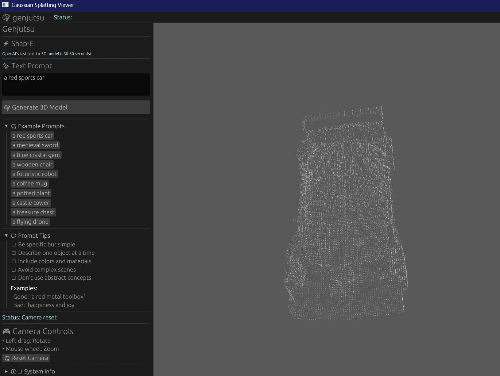

# genjutsu

A high-performance desktop application for generating interactive 3D scenes from text prompts or multi-view images using Gaussian Splatting rendering.




## 🎯 Features

- **✨ Text-to-3D Generation**: Create 3D models from text descriptions
- **📁 Multi-view Image Support**: Generate 3D from 4 orthographic view images
- **🎨 Real-time Gaussian Splatting**: High-performance 3D rendering using WebGPU
- **🎮 Interactive Camera Controls**: Smooth rotation, zoom, and pan
- **⚡ Asynchronous Processing**: Non-blocking generation with live progress updates
- **🖥️ Cross-platform**: Works on Windows, macOS, and Linux

## 🏗️ Architecture

```
┌─────────────────────────────────────────────────────────┐
│                    Rust Frontend (egui)                  │
│  ┌──────────────┐  ┌──────────────┐  ┌──────────────┐  │
│  │  UI (egui)   │  │ Event System │  │ Camera Ctrl  │  │
│  └──────────────┘  └──────────────┘  └──────────────┘  │
└─────────────────────────────────────────────────────────┘
                          │
                          ▼
┌─────────────────────────────────────────────────────────┐
│              Rendering (WebGPU + wgpu)                   │
│  ┌──────────────────────────────────────────────────┐   │
│  │  Gaussian Splatting Renderer                     │   │
│  │  - Instanced quad rendering                      │   │
│  │  - Alpha blending                                │   │
│  │  - Adaptive culling                              │   │
│  └──────────────────────────────────────────────────┘   │
└─────────────────────────────────────────────────────────┘
                          │
                          ▼
┌─────────────────────────────────────────────────────────┐
│            3D Generation Pipeline (Async)                │
│                                                          │
│  Text Prompt ──────┐                                    │
│                    ▼                                     │
│         ┌──────────────────────┐                        │
│         │  GaussianDreamer     │ (Python Service)       │
│         │  HTTP API            │                        │
│         └──────────────────────┘                        │
│                    │                                     │
│                    ▼                                     │
│         ┌──────────────────────┐                        │
│         │  .ply Gaussian Cloud │                        │
│         └──────────────────────┘                        │
│                    │                                     │
│  OR                │                                     │
│                    ▼                                     │
│  Images ──> ┌──────────────────────┐                    │
│             │  LGM Pipeline (Burn) │                    │
│             └──────────────────────┘                    │
│                    │                                     │
│                    ▼                                     │
│         ┌──────────────────────┐                        │
│         │  Gaussian Cloud      │                        │
│         └──────────────────────┘                        │
└─────────────────────────────────────────────────────────┘
```

## 🚀 Quick Start

### Prerequisites

- **Rust**: 1.75+ ([Install](https://rustup.rs/))
- **Python**: 3.8+ (for GaussianDreamer service)
- **GPU**: CUDA-compatible GPU recommended (CPU fallback available)

### Installation

1. **Clone the repository**
```bash
git clone https://github.com/gang-misinformation/genjutsu.git
cd genjutsu
```

2. **Build the Rust application**
```bash
cargo build --release
```

3. **Set up Python environment** (for text-to-3D)
```bash
cd python
pip install -r requirements.txt
```

4. **Start the GaussianDreamer service**
```bash
python gaussiandreamer_service.py
```

5. **Run the application**
```bash
cargo run --release
```

## 📖 Usage

### Text-to-3D Generation

1. Enter a text prompt in the sidebar (e.g., "a red sports car")
2. Click "🎨 Generate 3D Model"
3. Wait for generation to complete (~2-5 minutes)
4. Interact with the generated 3D model

**Example Prompts:**
- `a yellow rubber duck`
- `a blue crystal gem`
- `a wooden chair`
- `a futuristic spaceship`

### Multi-view Image Generation

1. Click "📂 Load Images..." in the sidebar
2. Select 4 orthographic view images (front, right, back, left)
3. Click "Generate"
4. The 3D model will be reconstructed from the views

### Camera Controls

- **Rotate**: Left-click and drag
- **Zoom**: Mouse wheel
- **Reset**: Click "🔄 Reset Camera" button

## 🏛️ Project Structure

```
.
├── crates/
│   ├── gj-app/           # Main application
│   │   ├── src/
│   │   │   ├── app.rs    # Application entry point
│   │   │   ├── state.rs  # Application state management
│   │   │   ├── ui/       # UI components (egui)
│   │   │   ├── events.rs # Event system
│   │   │   └── gfx.rs    # Graphics state (wgpu)
│   │   └── Cargo.toml
│   │
│   ├── gj-core/          # Core data structures
│   │   ├── src/
│   │   │   ├── gaussian_cloud.rs  # Gaussian splat data
│   │   │   └── error.rs           # Error types
│   │   └── Cargo.toml
│   │
│   ├── gj-lgm/           # LGM generation pipeline
│   │   ├── src/
│   │   │   ├── pipeline.rs        # Main LGM pipeline
│   │   │   ├── model.rs           # Neural network model
│   │   │   ├── preprocessing.rs   # Image preprocessing
│   │   │   └── text_to_image.rs   # GaussianDreamer integration
│   │   └── Cargo.toml
│   │
│   └── gj-splat/         # Gaussian splatting renderer
│       ├── src/
│       │   ├── renderer.rs        # Main renderer
│       │   └── camera.rs          # Camera controller
│       ├── shaders/
│       │   ├── gaussian.wgsl      # Full splatting shader
│       │   └── gaussian_simple.wgsl  # Optimized shader
│       └── Cargo.toml
│
├── python/
│   ├── gaussiandreamer_service.py  # Text-to-3D service
│   └── requirements.txt
│
├── Cargo.toml            # Workspace configuration
└── README.md
```

## 🔧 Configuration

### Rendering Performance

Adjust these in `crates/gj-splat/src/renderer.rs`:

```rust
// Opacity threshold (higher = fewer splats, faster)
opacity > 0.1  // Default: 0.1

// Scale multiplier (smaller = smaller splats)
scale * 0.5    // Default: 0.5

// Opacity multiplier (lower = more transparent)
opacity * 0.4  // Default: 0.4
```

### GaussianDreamer Settings

In `crates/gj-lgm/src/text_to_image.rs`:

```rust
pub struct GaussianDreamerConfig {
    pub service_url: String,        // Default: "http://127.0.0.1:5000"
    pub guidance_scale: f32,         // Default: 7.5
    pub num_iterations: usize,       // Default: 500
}
```

## 🐛 Troubleshooting

### Application won't start
- **Check GPU drivers**: Ensure your GPU drivers are up to date
- **Try CPU fallback**: Set `WGPU_BACKEND=dx11` (Windows) or `WGPU_BACKEND=vulkan` (Linux)

### GaussianDreamer service connection failed
- **Verify service is running**: `curl http://127.0.0.1:5000/health`
- **Check firewall**: Ensure port 5000 is not blocked
- **View service logs**: Check console output of `gaussiandreamer_service.py`

### Slow rendering / Low FPS
- **Reduce Gaussian count**: Increase opacity threshold in renderer
- **Use simplified shader**: Switch to `gaussian_simple.wgsl`
- **Lower resolution**: Reduce window size
- **Update GPU drivers**: Ensure latest drivers installed

### Scattered/messy 3D output
- This is expected with the placeholder service
- For real results, install full GaussianDreamer (see below)

## 🔬 Advanced: Installing Real GaussianDreamer

The included Python service uses a placeholder implementation. For real text-to-3D generation:

1. **Clone GaussianDreamer**
```bash
cd python
git clone https://github.com/hustvl/GaussianDreamer.git
cd GaussianDreamer
```

2. **Follow their installation guide**
```bash
# Install dependencies
pip install -r requirements.txt

# Download pre-trained models
bash python/download_models.sh
```

3. **Integrate with service**
```python
# In gaussiandreamer_service.py, uncomment:
from gaussiandreamer import GaussianDreamerPipeline
GAUSSIANDREAMER_AVAILABLE = True
```

4. **Restart service**
```bash
python gaussiandreamer_service.py
```

## 🎓 Technical Details

### Gaussian Splatting

This project uses **3D Gaussian Splatting** for rendering, which represents scenes as collections of 3D Gaussians with:
- **Position**: 3D center point
- **Scale**: Size along each axis
- **Rotation**: Quaternion orientation
- **Color**: RGB appearance
- **Opacity**: Transparency

Each Gaussian is rendered as a textured quad with Gaussian falloff, blended using alpha compositing.

### LGM Pipeline

**Large Gaussian Model (LGM)** is a feedforward neural network that:
1. Takes 4 multi-view images (256×256 each)
2. Processes through CNN layers
3. Outputs Gaussian parameters for ~260k points
4. Fast inference (~1 second on GPU)

**Note**: LGM requires geometrically consistent multi-view images. For text-to-3D, we use GaussianDreamer instead.

### Asynchronous Architecture

- **Main thread**: UI and rendering (60 FPS target)
- **Tokio runtime**: File I/O and networking
- **Worker thread**: 3D generation pipeline
- **Python service**: Heavy ML inference

This ensures the UI remains responsive during generation.

## 📊 Performance Benchmarks

| Operation | Time (GPU) | Time (CPU) |
|-----------|------------|------------|
| Load 4 images | ~100ms | ~200ms |
| LGM inference | ~1s | ~10s |
| GaussianDreamer generation | ~3-5min | ~15-30min |
| Render frame (50k splats) | ~16ms | ~100ms |

*Tested on RTX 2060 Ti, i7-9750H*

Please open an issue before starting major work.

## 📝 License

This project is licensed under the MIT License - see the [LICENSE](LICENSE) file for details.

## 🙏 Acknowledgments

- **GaussianDreamer**: Text-to-3D generation ([Paper](https://arxiv.org/abs/2310.08529))
- **LGM**: Large Gaussian Model ([Paper](https://arxiv.org/abs/2402.05054))
- **3D Gaussian Splatting**: Original rendering technique ([Paper](https://repo-sam.inria.fr/fungraph/3d-gaussian-splatting/))
- **egui**: Immediate mode GUI framework
- **wgpu**: WebGPU implementation in Rust
- **Burn**: Deep learning framework in Rust
